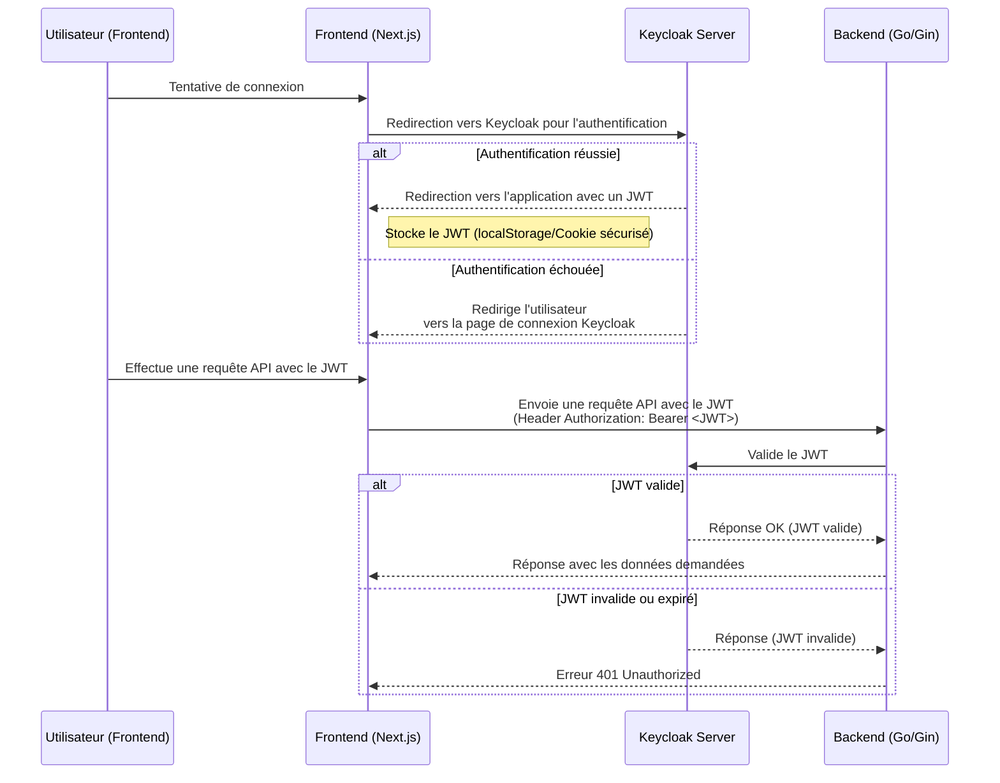

# Sharingan - Application Monitoring System


Sharingan is a comprehensive application monitoring system designed to help teams track, manage, and respond to application incidents effectively. The system provides real-time monitoring, incident management, and notification capabilities.

## Quick Start

```bash
# Clone the repository
git clone https://github.com/yourusername/sharingan.git

# Set up environment variables
cp .env.example .env
cp api/.env.example api/.env
cp frontend/.env.example frontend/.env

# Start development environment
docker-compose -f compose.dev.yaml up -d
```

## Architecture

Sharingan uses a modern microservices architecture:

- **Frontend**: Next.js-based user interface
- **Backend API**: Go/Gin RESTful API
- **Authentication**: Keycloak for identity and access management
- **Database**: PostgreSQL for data persistence

### Authentication Workflow


## Core Features

- **Application Group Management**: Organize applications into logical groups
- **Real-time Monitoring**: Monitor application health with customizable checks
- **Incident Management**: Track and resolve application incidents
- **User Authentication**: Secure access with Keycloak integration
- **Notification System**: Subscribe to alerts for specific applications

## Data Models

### Application Group
An organizational unit that contains multiple applications.

### Application
A monitored application with URL, success criteria, and related incidents.

### Incident
A record of an event or problem related to an application.

## Tech Stack

- **Frontend**: Next.js, TypeScript, React
- **Backend**: Go, Gin Framework
- **Database**: PostgreSQL
- **Authentication**: Keycloak
- **Containerization**: Docker, Docker Compose
- **Documentation**: Swagger

## Project Structure

```
sharingan/
├── api/              # Go backend API
├── frontend/         # Next.js frontend application
├── devops/           # DevOps configurations and tools
├── class_diagram.uxf # UML class diagram
├── compose.dev.yaml  # Docker Compose for development
└── command.sh        # Utility shell scripts
```

## Development

### Prerequisites

- Docker and Docker Compose
- Go 1.20+
- Node.js 18+
- PostgreSQL 17

### Development Environment

The development environment can be started using Docker Compose:

```bash
docker-compose -f compose.dev.yaml up -d
```

This will start all services including:
- Frontend (Next.js)
- Backend API (Go/Gin)
- PostgreSQL database
- Keycloak authentication server
- PGAdmin database interface

### API Documentation

API documentation is available via Swagger UI at `/swagger/index.html` when the API is running.

## Utility Scripts

The project includes various utility scripts in `command.sh` to help with common development tasks:

```bash
# Generate .env.example files from .env files
./command.sh generate-env-example

# Additional commands can be found by exploring the script
```

## Testing

### API Tests

```bash
cd api
go test ./tests/... -v
```

### Frontend Tests

```bash
cd frontend
npm test
```

## CI/CD and Deployment

Sharingan uses automated CI/CD pipelines for building, testing, and deploying the application.

### Container Registry

The project supports multiple container registries:

- **GitLab Container Registry**: Images are automatically built and pushed to GitLab Registry using GitLab CI Pipeline
- **GitHub Container Registry**: Support for GitHub Container Registry using GitHub Actions is planned (not yet implemented)

### Deployment

The application is designed to be deployed on AWS using Kubernetes and Helm charts:

- EKS for container orchestration
- RDS for PostgreSQL database
- ECR for container images
- CloudWatch for monitoring and logging

See the [DevOps README](./devops/README.md) for detailed deployment instructions.

## Contributing

Contributions are welcome! Please follow these steps:

1. Fork the repository
2. Create a feature branch (`git checkout -b feature/amazing-feature`)
3. Commit your changes (`git commit -m 'Add some amazing feature'`)
4. Push to the branch (`git push origin feature/amazing-feature`)
5. Open a Pull Request

## License

This project is licensed under the MIT License - see the LICENSE file for details.

## Acknowledgements

- [Gin Web Framework](https://github.com/gin-gonic/gin)
- [Next.js](https://nextjs.org/)
- [Keycloak](https://www.keycloak.org/)
- [PostgreSQL](https://www.postgresql.org/)
- [Docker](https://www.docker.com/) 