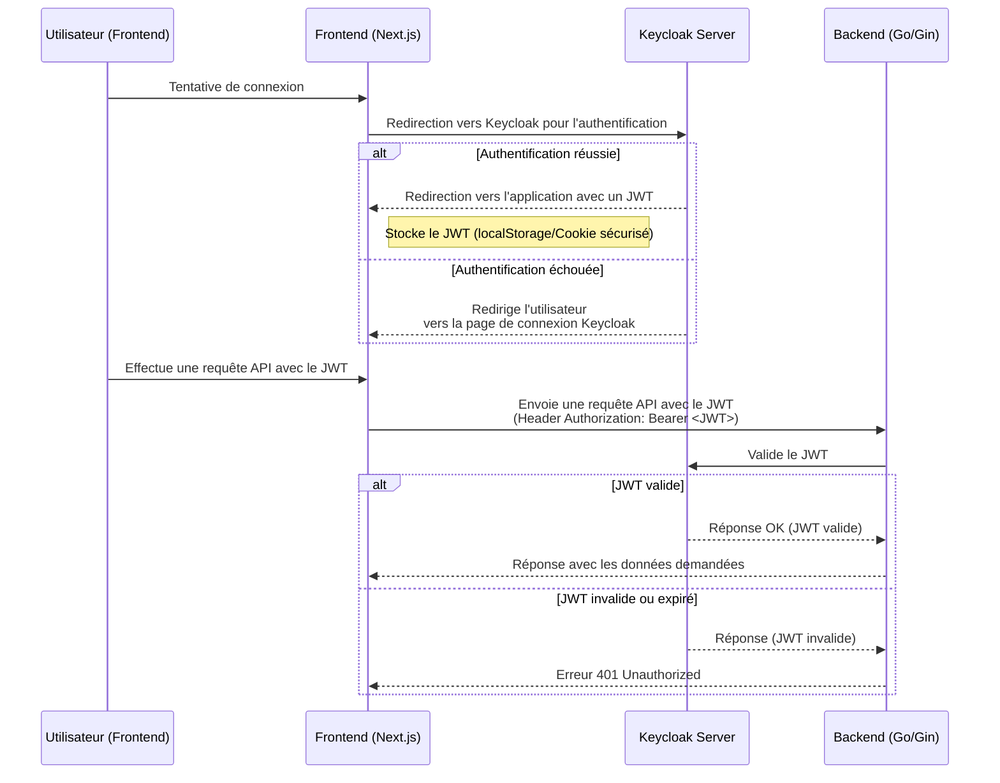

# Authentication workflow 

```mermaid
sequenceDiagram
    participant User as Utilisateur (Frontend)
    participant Frontend as Frontend (Next.js)
    participant Keycloak as Keycloak Server
    participant Backend as Backend (Go/Gin)
    
    User->>Frontend: Tentative de connexion
    Frontend->>Keycloak: Redirection vers Keycloak pour l'authentification
    alt Authentification réussie
        Keycloak-->>Frontend: Redirection vers l'application avec un JWT
        note right of Frontend: Stocke le JWT (localStorage/Cookie sécurisé)
    else Authentification échouée
        Keycloak-->>Frontend: Redirige l'utilisateur<br>vers la page de connexion Keycloak
    end
    
    User->>Frontend: Effectue une requête API avec le JWT
    Frontend->>Backend: Envoie une requête API avec le JWT<br>(Header Authorization: Bearer <JWT>)
    Backend->>Keycloak: Valide le JWT
    alt JWT valide
        Keycloak-->>Backend: Réponse OK (JWT valide)
        Backend-->>Frontend: Réponse avec les données demandées
    else JWT invalide ou expiré
        Keycloak-->>Backend: Réponse (JWT invalide)
        Backend-->>Frontend: Erreur 401 Unauthorized
    end
``` 